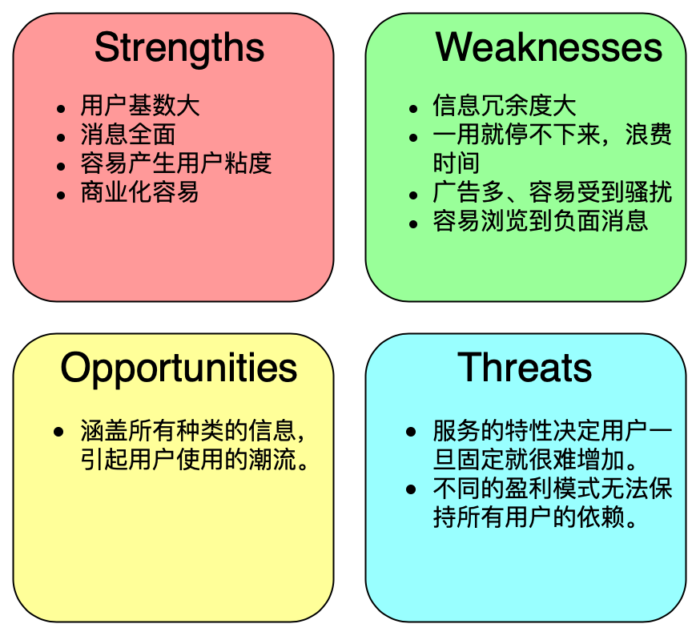
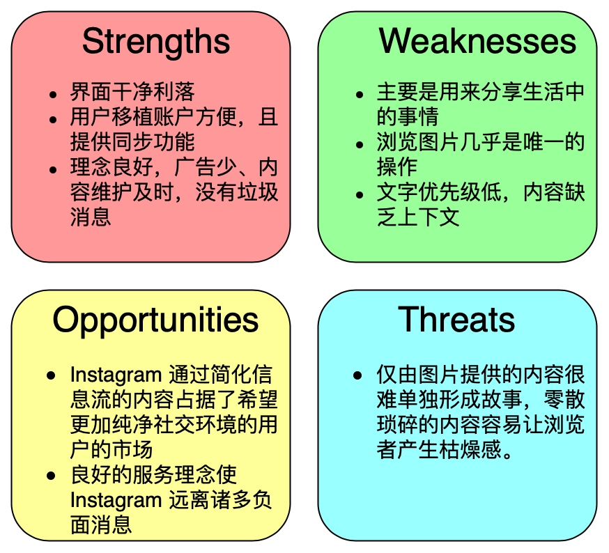
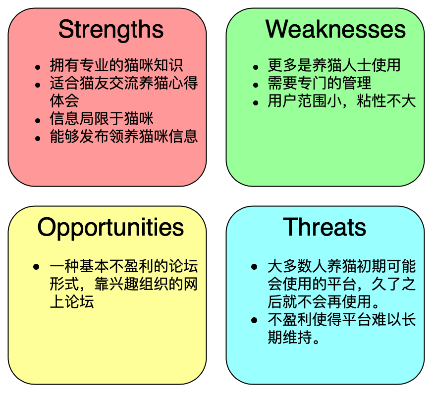
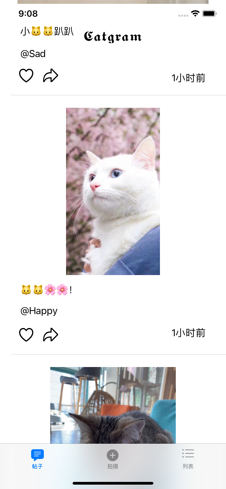
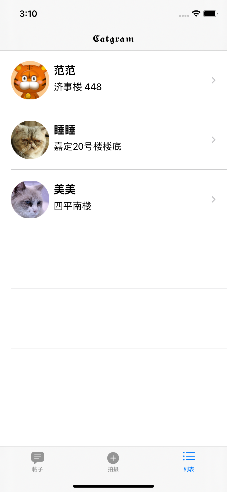
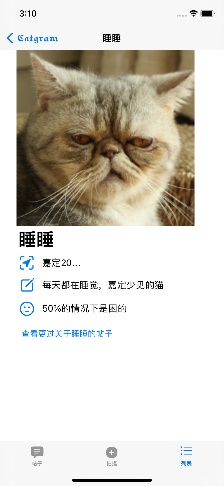
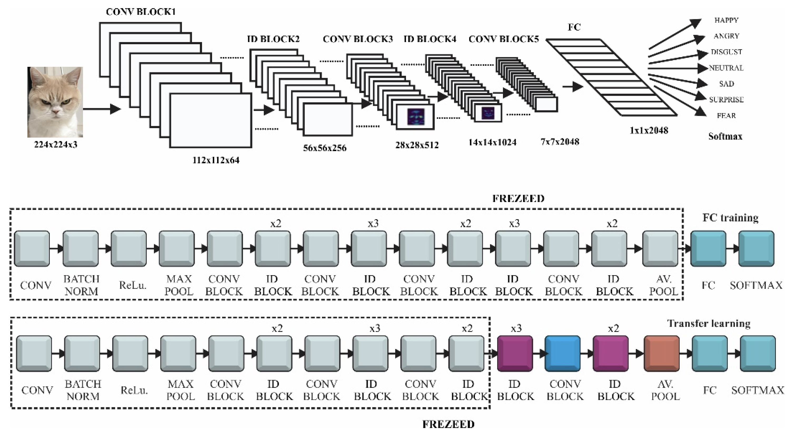
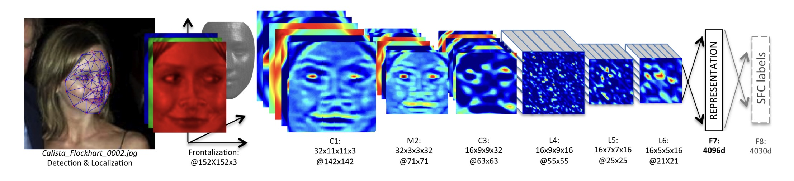

# iOS dev 2020-2021 Spring Final - Catgram

## 产品简介

  </img> 

Catgram是一款基于人工智能的同济校园猫咪图片社交iOS应用，以一种快速、美妙和有趣的方式将用户随时抓拍到的校园内流浪猫的照片与Catgram上的猫咪爱好者们分享。

Catgram的名字受到了社交平台Instagram的启发，我们希望打造一个如同Instagram一样纯净简洁但不乏优质内容的iOS社交平台。用户在使用时，可以在主页时间线上看到校园猫猫的实时动态，可以选择上传最近抓拍到的校猫图片，识别其心情和名字并上传到社区，也可以查看同济校猫的列表，欣赏每一只猫猫的美照。

我们希望，Catgram能够以iOS应用和AI技术，致力于同济大学流浪猫的救助和保护，让每一个生命都被在意和爱护。

## 产品分析

### 项目动机

社交软件是当今人们生活中不可或缺的一部分，国内的微博、抖音，外国的 Instagram、Facebook 等平台作为当今世界上火热的社交自媒体平台，每天都能产生千万级别的用户活跃活动。而现存的校园社交媒体平台多数是基于博客，校园内的学生用户可以在平台上分享校园里的各种事情。

与现在的大流量自媒体平台不同，早起的媒体平台大都有固定的主题，用户可以围绕主题发帖，且游客身份也能发送相关内容。虽然综合平台是一个趋势，覆盖的内容越广，使用的用户就会越多，但是一个单一内容平台能够对应减少用户使用的时间。Instagram 是一个很好的例子，通过限制用户发帖的形式（图片+一小段文字）和有限的操作来提高产品的纯净度，减少了不必要的信息量。

在同济大学校园内，并没有单独的自媒体软件产品可以将校内的学生联系起来。学生使用的校园内媒体平台如果什么都可以发送，也会出现时间浪费、不良信息等情况。提到同济，猫咪是校园内绕不开的话题（许多高校也是）。开发一个只含有猫咪的社交软件平台，在学习生活之余可以治愈身心，并且也能帮助学生群体了解学校内的不同的猫咪出没的时间地点和生活习性。

校园内的猫咪大多是流浪猫，没有专人看管，所以对于猫的称呼并没有很好的统一，也不好产生某一只猫的故事梳理。通过引入机器学习的方式可以降低用户识别一只猫咪的成本，也方便用户将猫咪与名称对应，虽然是用户在发帖也能产生属于每一条猫咪的专属故事线。

通过一种基于人工智能的动物情绪识别机制，还能够在与猫咪近距离接触的时候察觉猫咪的心情，以便同学更加科学的“撸猫”。

### 竞品分析

市面上有两类产品与猫咪论坛的功能相互重叠：**移动社交媒体平台**和**网页猫咪论坛**。

以下是两类平台的SWOT分析：

* 移动社交平台，以微博、Twitter为主

* 移动社交平台：Instagram

* 现存的网页猫咪论坛

Catgram 平台对于以上平台的缺点有所补充，虽然使用的人数只局限于校园，但是能给学生提供良好的线上“撸猫”体验。提供机器学习的 Catgram 则是在平台内聚性基础之上增加了专业性，能够赢下高校的学生用户市场。

通过与学生群体相关的轻量化广告赞助植入，抑或是学校内相关领域的信息展示盈利足以支持这样一个平台的健康运营。用户提供的数据也将足以支持机器识别模型的优化。

## 功能概述

* **发帖**

  用户可以发送猫咪的帖子，发帖的格式为：一张或多张照片附上一小段文字（可选），并贴上相应的标签（tags，可选）。

* **识别猫咪身份**

  上传的图片在发送之前会自动识别，根据系统已有的校园猫咪数据库，能够给出该猫咪可能的身份（名字）、对应的其他照片以及系统给出的猫咪身份置信度。

* **判断猫咪当前心情**

  上传图片在发送之前会自动判断猫咪的心情，根据心情产生相应的心情标签供用户在发送帖子之前选择。

* **浏览帖子**

  发布后的帖子会在消息流中供用户阅读。用户还可以点击帖子下的标签来浏览根据标签归类的信息。

* **查看猫咪列表**

  拥有身份认证的猫咪将会出现在猫咪列表里。猫咪列表给出了不同猫咪的图片、常出现的位置、描述以及总体心情数据。通过猫咪列表还可以看到校园内“明星猫咪”的所有动态。

## 界面介绍

### 帖子视图

帖子视图展示了最近上传的猫咪照片，包括了猫咪心情预测结果以及上传者留言，用户可以对帖子进行点赞或分享操作。

### 发帖视图

发帖视图提供了拍摄、上传两个功能，用于拍摄或选择猫咪相关的图片上传至平台。

拍摄后，软件会根据模型判断图片内是否含有猫咪。如果猫咪的特征清晰，还会依照现有数据判断这只猫咪登记在系统内的名字并判断猫咪的心情，同时给出这两个数据的置信度供用户选择确认。用户也可以自己给添加相应的标签。

下图为上传一张模拟器自带的图片，按照预期，这张图片上传时将会提示用户确认照片是否内含有猫咪，并提示用户没有猫咪的图片将有可能被举报并被管理员删除。

### 列表视图

猫咪列表视图提供了所有登记在软件中的猫咪以及猫咪的简介，用户可以通过列表方便地查看校园内所有的猫咪详情以及所有关于某只猫咪的帖子。

猫咪列表的界面如下：

猫咪详情页面如下：

## 模型推理

### 心情识别

心情识别部分拟采用在搜索引擎中爬虫获得猫脸数据集并且手动标注心情，完成分类模型，即为：猫的心情好/心情坏/平淡等。

1. 使用labelme或者其他平台进行离线标注或者在线平台标注，如下图所示。

2. 使用Python下的Turi进行模型训练。使用简单的二分类ResNet50模型，即：输入为224 * 224 * 3的tensor，输出为1 * 2的tensor，即为猫开心和不开心的概率。拟训练300个epoch。

2. 将用Turi训练好的模型导出，导出模型的参数应为mlmodel格式。
3. 在项目中载入训练好的模型，其会自动生成一个模型类。
4. 创建模型类的实例对输入的图片进行推理即可。

###  猫脸识别

目前，人脸识别已经在工业界被大规模应用，然而猫脸识别的应用较少。大多数的模型只是对针对猫脸进行分类和目标检测。

我们拟采用DeepFace作为猫脸识别模型，同济猫盟提供的猫猫图片和标签作为数据集进行训练。

